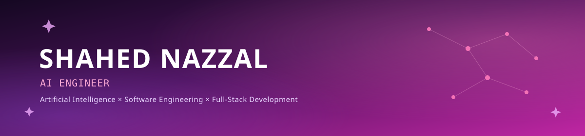

 

### 👩‍💻 About Me

- 🎓 AI & Data Science graduate, **Yarmouk University**
- 🧠 Focused on **Computer Vision**, **Generative AI (RAG/LLMs)**, and AI-powered web applications
- 🛠️ Comfortable across the full stack — from training models to shipping the product they live in
- 🌱 Currently exploring **cloud infrastructure** for AI deployment
- 📫 Reach me at [shahednazzall.777@gmail.com](mailto:shahednazzall.777@gmail.com)

---

### 🧰 Tech Stack

**AI / ML:** Machine Learning · Deep Learning · Computer Vision · YOLOv8 · Neural Networks
**Generative AI:** RAG · LLMs · Embeddings · Vector Databases
**Data:** Data Analysis · Statistics · Power BI · Tableau · scikit-learn
**Web:** Next.js · React · TypeScript · FastAPI · REST APIs · Supabase

---

### 🚀 Featured Projects

<table>
<tr>
<td width="50%" valign="top">

🚗 **[DriveSkills — AI Driving Evaluation System](https://github.com/ShahdNazzal/Ai-Based-Driving-Evaluation-System)**
Graduation project. Multi-model AI architecture (YOLOv8 detection & segmentation) evaluating practical driving exams — combining AI scoring (65%) with examiner input (35%).
`Next.js` `YOLOv8` `Supabase` `Hugging Face`

</td>
<td width="50%" valign="top">

🤖 **[Enterprise RAG System](https://github.com/ShahdNazzal/RAG)**
Retrieval-Augmented Generation system enabling grounded, document-based Q&A over internal company knowledge.
`Python` `FastAPI` `Vector DB` `Docker`
Frontend: [RAG-Website](https://github.com/ShahdNazzal/RAG-Website)

</td>
</tr>
<tr>
<td width="50%" valign="top">

🥗 **[NutriSense — AI Nutrition & Health Platform](https://github.com/ShahdNazzal/nutrisense-platform)**
AI-powered nutrition and wellness platform with smart tracking and personalized recommendations.
`Next.js` `AI` `Supabase`

</td>
<td width="50%" valign="top">

💪 **[Evolva](https://github.com/ShahdNazzal/Evolva)**
Full-stack fitness platform built with a modern React/TypeScript stack.
`React` `TypeScript` `Supabase`

</td>
</tr>
</table>

---

## 📊 GitHub Activity

  

  Building intelligent, practical AI systems — one project at a time.

